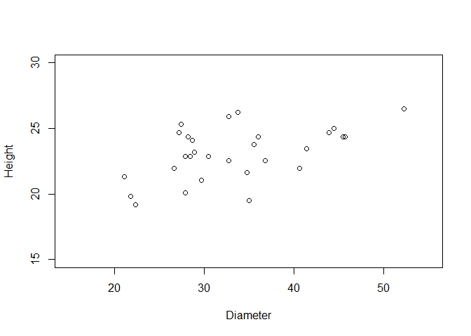
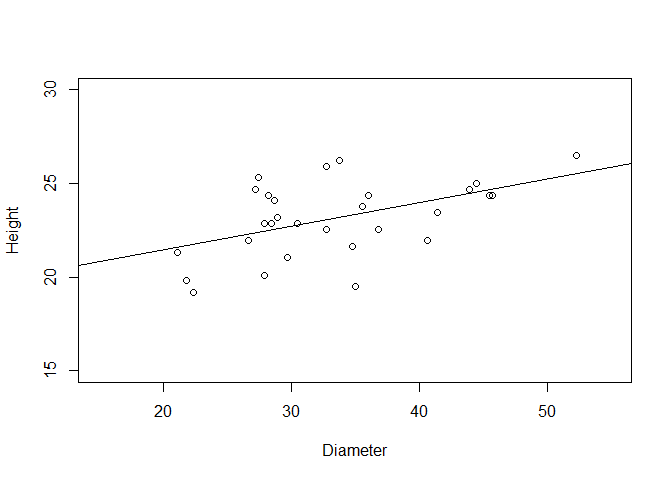
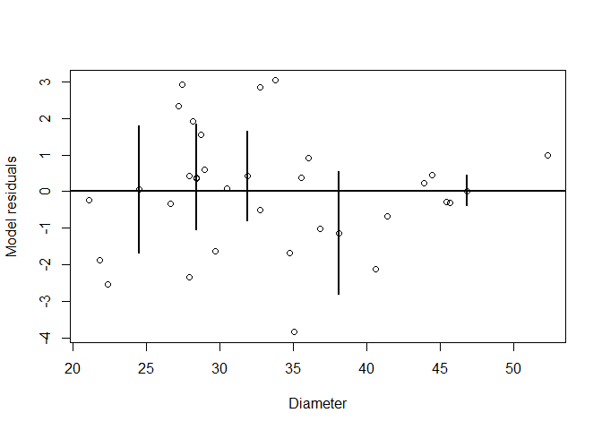
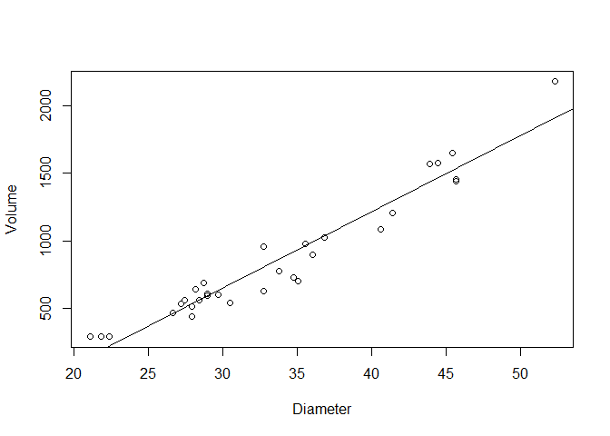
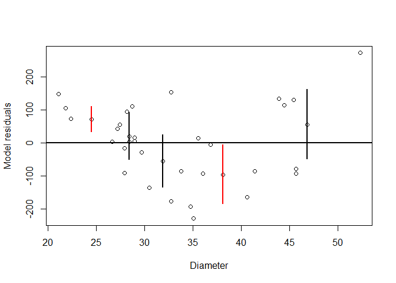
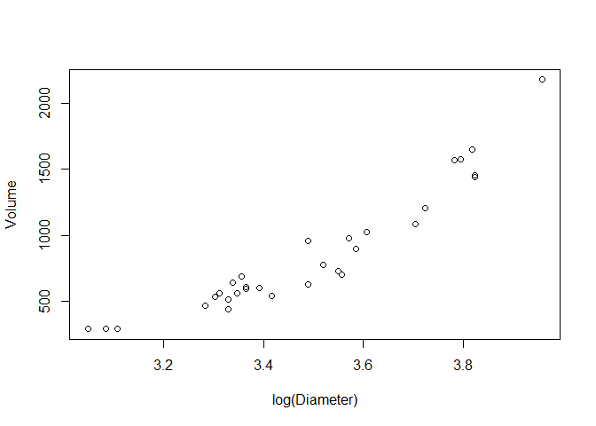
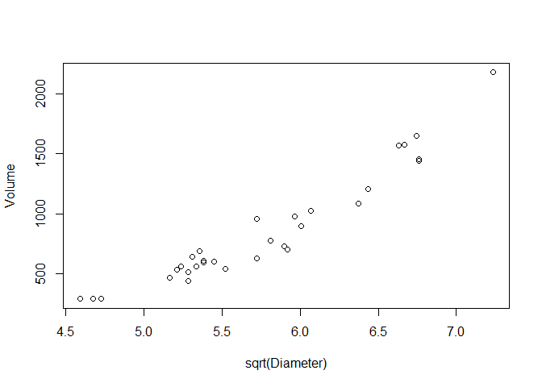
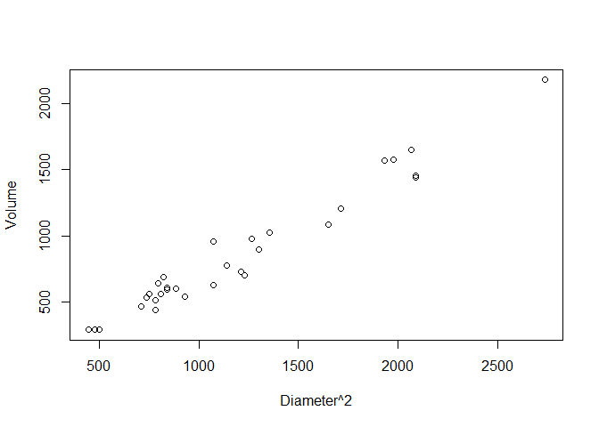
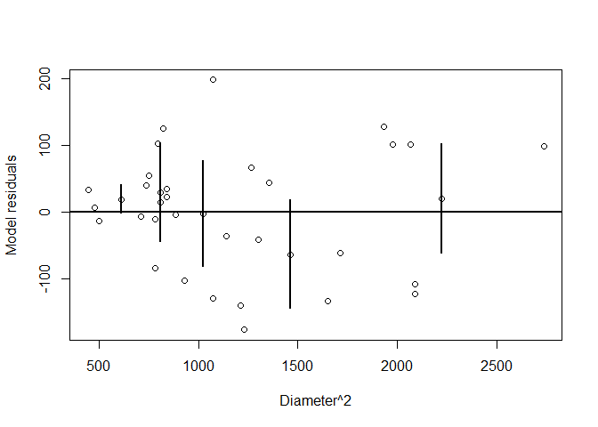
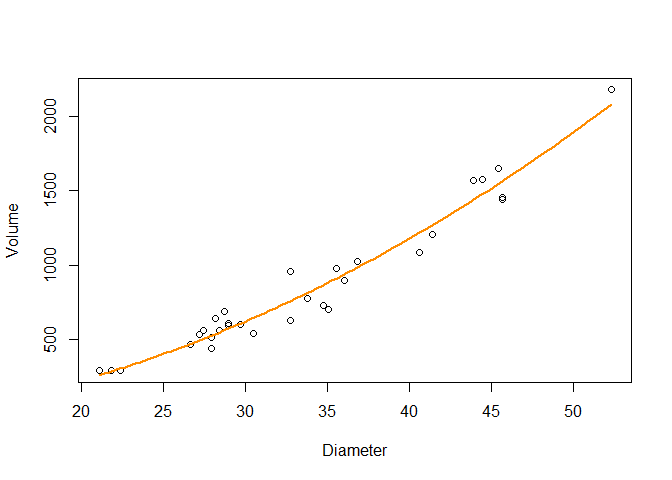

Linear regression on tree data
================
Nikolas Tolvanen
2025-01-14

## Dataset

The data contains information about black cherry trees. The data has
three variables: diameter, height and volume.

The objective of this analysis is to examine this data using linear
regression.

## Data Preprocessing

We download the data and transform the variables into metric units.
Volume will be in $dm^3$, height in meters, and diameter in centimeters.

``` r
# Download trees dataset
data(trees)

# Transfrom the variables to metric units
trees$Girth <- trees$Girth * 2.54
trees$Height <- trees$Height * 0.3048
trees$Volume <- trees$Volume * 28.316846592
```

``` r
# First rows of the dataset
head(trees)
```

    ##    Girth  Height   Volume
    ## 1 21.082 21.3360 291.6635
    ## 2 21.844 19.8120 291.6635
    ## 3 22.352 19.2024 288.8318
    ## 4 26.670 21.9456 464.3963
    ## 5 27.178 24.6888 532.3567
    ## 6 27.432 25.2984 557.8419

## Relationship between tree diameter and height

First, we plot height on diameter.

``` r
plot(trees$Girth, trees$Height, xlim = c(15, 55), ylim = c(15, 30), xlab = "Diameter", ylab = "Height")
```

<!-- -->

The plot of height on diameter shows a linear relationship.

Next, we fit the model

$$height_{i} = \beta_{0} + \beta_{1}diameter_{i} + \epsilon_{i}$$

to the data using least squares and add the estimated regression line to
the plot.

``` r
plot(trees$Girth, trees$Height, xlim = c(15, 55), ylim = c(15, 30), xlab = "Diameter", ylab = "Height")
model1 <- lm(Height ~ Girth, data = trees)
abline(model1)
```

<!-- -->

Next, we plot the residuals of the fitted model on diameter.

``` r
invisible(suppressWarnings({
  model2 <- lm(Height~Girth, data = trees)
  plot(trees$Girth, residuals(model2), xlab = "Diameter", ylab = "Model residuals")
  abline(0,0, lwd = 2)
  library(lmfor)
  mywhiskers(trees$Girth, residuals(model2), nclass=5, se=TRUE, add=TRUE, lwd=2)
}))
```

<!-- -->

It looks like there aren’t any trends in the residuals. This means that
the simple linear model is sufficient for this data.

``` r
# Show the model coefficients
summary(model2)$coefficients
```

    ##               Estimate Std. Error   t value     Pr(>|t|)
    ## (Intercept) 18.9071445 1.33603054 14.151731 1.492972e-14
    ## Girth        0.1265243 0.03866679  3.272169 2.757815e-03

The estimate $\hat{\beta_{0}}$ is approximately 18.907 and the estimate
$\hat{\beta_{1}}$ is approximately 0.127.

If the diameter increases by one centimeter, the tree height is expected
to increase 0.127 meters.

## Relationship between tree diameter and volume

Let’s draw a scatter plot of volume on diameter, fit the model

$$volume_{i} = \beta_{0} + \beta_{1}diameter_{i} + \epsilon_{i}$$

to the data, and add the regression line.

``` r
# Draw scatter plot
plot(trees$Girth, trees$Volume, xlab = "Diameter", ylab = "Volume")
# Fit model
model3 <- lm(Volume~Girth, data = trees)
# Add regression line
abline(model3)
```

<!-- -->

It looks like the model does not fit the data. Let’s draw the residual
plot and analyze it to examine the model’s fit more closely.

``` r
invisible({
  model4 <- lm(Volume~Girth, data = trees)
  plot(trees$Girth, residuals(model4), xlab="Diameter", ylab="Model residuals")
  abline(0,0, lwd = 2)
  library(lmfor)
  mywhiskers(trees$Girth, residuals(model4), nclass = 5, se=TRUE, add=TRUE, lwd=2)
})
```

<!-- -->

The relationship is not linear. The residuals are not following the
horizontal line but instead there is a trend where the residuals go from
high to low and then high again. This means that the systematic part of
the model is false and we need to fix the model.

Let’s choose the best of the following transformations for the variable
diameter: $x = ln(diameter)$, $x = \sqrt{diameter}$, $x = diameter^{2}$

``` r
trees$Log_diameter <- log(trees$Girth)
trees$Sqrt_diameter <- sqrt(trees$Girth)
trees$Square_diameter <- trees$Girth^2

plot(trees$Log_diameter, trees$Volume, xlab = "log(Diameter)", ylab = "Volume")
```

<!-- -->

``` r
plot(trees$Sqrt_diameter, trees$Volume, xlab = "sqrt(Diameter)", ylab = "Volume")
```

<!-- -->

``` r
plot(trees$Square_diameter, trees$Volume, xlab = "Diameter^2", ylab = "Volume")
```

<!-- -->

It seems that the transformation $x = diameter^{2}$ results in a linear
relationship with the volume. Let’s draw the residual plot and analyze
the model’s fit.

``` r
invisible({
  model5 <- lm(Volume~Square_diameter, data = trees)
  plot(trees$Square_diameter, residuals(model5), xlab="Diameter^2", ylab="Model residuals")
  abline(0,0, lwd = 2)
  library(lmfor)
  mywhiskers(trees$Square_diameter, residuals(model5), nclass = 5, se=TRUE, add=TRUE, lwd=2)
})
```

<!-- -->

Now the systematic part of the model is correctly specified.

``` r
# Fit the model
model6 <- lm(Volume~Square_diameter, data = trees)
# Draw the scatter plot.
plot(trees$Girth, trees$Volume, xlab = "Diameter", ylab = "Volume")

# Add regression line
x <- seq(min(trees$Girth), max(trees$Girth), length=100)
lines(x, coef(model6)[1] + coef(model6)[2] * x^2, lwd=2, col = "darkorange")
```

<!-- -->

The orange regression line is presented by the formula
$\beta_{0} + \beta_{1}diameter^2$. This line fits better to the data
than the previous straight line.

``` r
# Summary of the fitted model
summary(model6)
```

    ## 
    ## Call:
    ## lm(formula = Volume ~ Square_diameter, data = trees)
    ## 
    ## Residuals:
    ##      Min       1Q   Median       3Q      Max 
    ## -176.909  -72.882    7.237   60.432  198.391 
    ## 
    ## Coefficients:
    ##                  Estimate Std. Error t value Pr(>|t|)    
    ## (Intercept)     -95.00704   40.12219  -2.368   0.0248 *  
    ## Square_diameter   0.79519    0.03039  26.169   <2e-16 ***
    ## ---
    ## Signif. codes:  0 '***' 0.001 '**' 0.01 '*' 0.05 '.' 0.1 ' ' 1
    ## 
    ## Residual standard error: 95.42 on 29 degrees of freedom
    ## Multiple R-squared:  0.9594, Adjusted R-squared:  0.958 
    ## F-statistic: 684.8 on 1 and 29 DF,  p-value: < 2.2e-16

$\hat{\beta_{0}}$ is -95.00704. $\hat{\beta_{1}}$ is 0.79519.

-95.01 is the expected volume for a tree if the diameter is 0 cm.
0.79519 is the increase of volume by $dm^3$ if $diameter^2$ increases
one unit.

We get the expected volume with the following formula:

$$\hat{volume} = -95.00704 + 0.79519 * diameter^2$$

With this formula, we can compute the estimated effect of a
one-centimeter increase in diameter on expected volume for trees with
diameters 10, 30 and 50 cm.

``` r
# Diameter 10 cm -> 11 cm
(-95.00704 + 0.79519 * 11^2) - (-95.00704 + 0.79519 * 10^2)
```

    ## [1] 16.69899

If the diameter increases from 10 cm to 11 cm, the increase in expected
volume is 16.7 $dm^3$.

``` r
# Diameter 30 cm -> 31 cm
(-95.00704 + 0.79519 * 31^2) - (-95.00704 + 0.79519 * 30^2)
```

    ## [1] 48.50659

If the diameter increases from 30 cm to 31 cm, the increase in expected
volume is 48.51 $dm^3$.

``` r
# Diameter 50 cm -> 51 cm
(-95.00704 + 0.79519 * 51^2) - (-95.00704 + 0.79519 * 50^2)
```

    ## [1] 80.31419

If the diameter increases from 50 cm to 51 cm, the increase in expected
volume is 80.31 $dm^3$.
